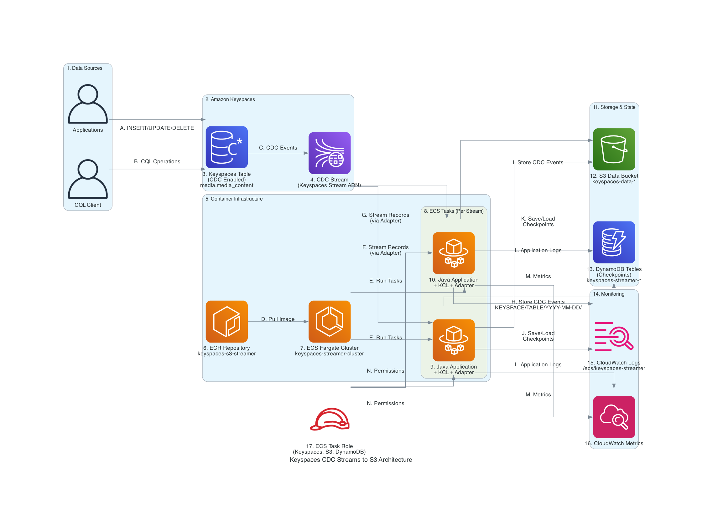

# Keyspaces CDC Streams to S3

A Java application that streams Amazon Keyspaces Change Data Capture (CDC) events to Amazon S3 using the AWS Keyspaces Streams Kinesis Adapter.

## Overview

This project demonstrates how to:
- Consume CDC events from Amazon Keyspaces tables
- Process the events using Kinesis Client Library (KCL)
- Store processed events in Amazon S3 buckets
- Deploy the solution using ECS Fargate and Terraform

## Architecture

This project implements a streaming architecture that processes Amazon Keyspaces CDC events and stores them in S3. 



Detailed flow of architecture can be referred at [Architecture Description](architecture/ARCHITECTURE.md)

For step-by-step data flow visualization, see [Data Flow Diagram](architecture/DATA_FLOW.md)

## Prerequisites

- Java 8 or higher (Verified Java version: 17.0)
- Maven 3.6+ (Verified Maven version: 3.9.10)
- Docker
- AWS CLI configured with appropriate permissions
- Terraform (for infrastructure deployment)

## Quick Start

### 1. Setup Dependencies

The project requires the AWS Keyspaces Streams Kinesis Adapter to be built locally. Run the automated setup:

```bash
./infrastructure/scripts/setup-dependencies.sh
```

This script will:
- Check prerequisites (Java 8+, Maven 3.6+, Git). Verified on Java version: 17.0 & Maven version: 3.9.10
- Clone and build the Keyspaces Streams Kinesis Adapter from GitHub
- Install it to your local Maven repository
- Verify your project builds successfully

**Note**: This is a one-time setup per development environment.

### 2. Create Keyspaces Table with CDC

From AWS Console, create keyspace and tables. Execute each command separately:

```cql
CREATE KEYSPACE media WITH replication = {'class': 'SingleRegionStrategy'};
```

```cql
CREATE TABLE media.media_content (
    content_id uuid,
    title text,
    creator_id uuid,
    media_type text,
    upload_timestamp timestamp,
    status text,
    PRIMARY KEY (content_id)
) WITH cdc = true
AND CUSTOM_PROPERTIES = {
  'cdc_specification': {
    'view_type': 'NEW_AND_OLD_IMAGES'
  }
};
```

### 3. Get CDC Stream ARN

After creating the table, get the CDC stream ARN:

```bash
aws keyspaces get-table --keyspace-name media --table-name media_content --query 'latestStreamArn' --output text
```

Save this ARN as you'll need it for the application configuration.

### 4. Deploy Infrastructure

Run the automated deployment script:

```bash
./infrastructure/scripts/deploy.sh
```

Or follow the manual deployment steps in [DEPLOYMENT.md](DEPLOYMENT.md).

### 5. Test with Sample Data

Insert some test records:

```cql
INSERT INTO media.media_content (content_id, title, creator_id, media_type, upload_timestamp, status) VALUES (uuid(), 'Summer Vacation Video', uuid(), 'video', toTimestamp(now()), 'active');
INSERT INTO media.media_content (content_id, title, creator_id, media_type, upload_timestamp, status) VALUES (uuid(), 'Birthday Party Photos', uuid(), 'image', toTimestamp(now()), 'processing');
INSERT INTO media.media_content (content_id, title, creator_id, media_type, upload_timestamp, status) VALUES (uuid(), 'Podcast Episode 1', uuid(), 'audio', toTimestamp(now()), 'active');
```

### 6. Verify S3 Output

Records are stored in S3 with the pattern: `KEYSPACE/TABLE_NAME/YYYY-MM-DD/SEQUENCE_NUMBER.json`

## Key Features

- **Multi-stream Support**: Process multiple Keyspaces streams simultaneously
- **Fault Tolerance**: DynamoDB checkpoints ensure no data loss
- **Auto-scaling**: ECS Fargate handles scaling automatically
- **Monitoring**: CloudWatch integration for logs and metrics
- **Security**: IAM roles with least-privilege access

## Troubleshooting

### Dependency Issues

If you encounter build errors related to the Keyspaces Streams Kinesis Adapter:

1. **Run the setup script**: `./infrastructure/scripts/setup-dependencies.sh`
2. **Check your local Maven repository**: The adapter should be installed at `~/.m2/repository/software/amazon/keyspaces/keyspaces-streams-kinesis-adapter/1.0.0/`
3. **Clean and rebuild**: `mvn clean package`

### Common Issues

- **"Could not find artifact software.amazon.keyspaces:keyspaces-streams-kinesis-adapter"**: Run `./infrastructure/scripts/setup-dependencies.sh` to build and install the adapter locally
- **Build failures**: Ensure you have Java 8+ and Maven 3.6+ installed
- **Git clone failures**: Check your internet connection and GitHub access

## Cleanup

To remove all AWS resources created by this project:

```bash
./infrastructure/scripts/cleanup.sh
```

This automated script will:
- Empty and delete S3 buckets
- Delete DynamoDB tables (including KCL checkpoints)
- Run `terraform destroy`
- Delete ECR repositories
- Remove IAM roles and policies
- Delete CloudWatch log groups


## References

- [Amazon Keyspaces (for Apache Cassandra) now supports Change Data Capture (CDC) Streams](https://aws.amazon.com/about-aws/whats-new/2025/07/amazon-keyspaces-apache-cassandra-cdc-streams/)
- [Working with change data capture (CDC) streams in Amazon Keyspaces](https://docs.aws.amazon.com/keyspaces/latest/devguide/cdc.html)

### Service Best practices

- [Best practices for designing and architecting with Amazon Keyspaces (for Apache Cassandra)](https://docs.aws.amazon.com/keyspaces/latest/devguide/best-practices.html)
- [Amazon ECS best practices](https://docs.aws.amazon.com/AmazonECS/latest/developerguide/ecs-best-practices.html)
- [Best practices design patterns: optimizing Amazon S3 performance](https://docs.aws.amazon.com/AmazonS3/latest/userguide/optimizing-performance.html)
- [Best practices for designing and architecting with DynamoDB](https://docs.aws.amazon.com/amazondynamodb/latest/developerguide/best-practices.html)

### Security best practices

- [Security best practices for Amazon Keyspaces](https://docs.aws.amazon.com/keyspaces/latest/devguide/best-practices-security.html)
- [Security best practices and use cases in AWS Identity and Access Management](https://docs.aws.amazon.com/IAM/latest/UserGuide/best-practices-use-cases.html)
- [Security best practices in IAM](https://docs.aws.amazon.com/IAM/latest/UserGuide/best-practices.html)
- [Security in Amazon Elastic Container Service](https://docs.aws.amazon.com/AmazonECS/latest/developerguide/security.html)
- [Amazon S3 security best practices](https://docs.aws.amazon.com/AmazonS3/latest/userguide/security-best-practices.html)
- [Security and compliance in Amazon DynamoDB](https://docs.aws.amazon.com/amazondynamodb/latest/developerguide/security.html)


## Disclaimer

The sample code; software libraries; command line tools; proofs of concept; templates; or other related technology (including any of the foregoing that are provided by our personnel) is provided to you as AWS Content under the AWS Customer Agreement, or the relevant written agreement between you and AWS (whichever applies). You should not use this AWS Content in your production accounts, or on production or other critical data. You are responsible for testing, securing, and optimizing the AWS Content, such as sample code, as appropriate for production grade use based on your specific quality control practices and standards. Deploying AWS Content may incur AWS charges for creating or using AWS chargeable resources, such as running Amazon EC2 instances or using Amazon S3 storage.

## Contributing

See [CONTRIBUTING.md](CONTRIBUTING.md) for contribution guidelines.

## License

This project is licensed under the MIT No Attribution - see the [LICENSE](LICENSE) file for details.
