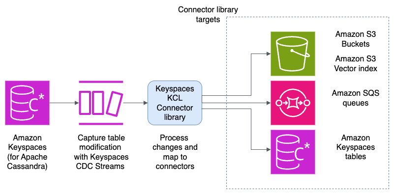

# Keyspaces CDC Streams Connectors

Move data from Amazon Keyspaces to different downstream targets using Keyspaces CDC Streams connectors. This library will allow you to deploy a Kinesis Client Library (KCL)-based application to stream data from your Keyspaces. The goal is to simplify connecting data sources to different targets. Different connectors can be added by extending the ITargetMapper interface. Configuration properties can be exposed in the streams-application.conf or environment variables.  

## Currently Available Connectors

### S3 Bucket Connector (`s3-bucket-connector`)
- Connector to S3 with supported formats: JSON, Avro
- Time-based partitioning support
- Configurable retry logic
- [Detailed Documentation](s3-bucket-connector/README.md)

### S3 Vector Connector (`s3-vector-connector`)
- Connector to S3 Vector Store with vector embeddings
- Amazon Bedrock integration for embedding generation
- Support for metadata fields
- [Detailed Documentation](s3-vector-connector/README.md) 

### Amazon Keyspaces Materialized View connector (`keyspaces-materialized-view`)
- Connector to create a materialized view in Amazon Keyspaces
- Select fields to move
- [Detailed Documentation](keyspaces-materialized-view-connector/README.md) 

## SQS Connector ('sqs-connector')
- Connector to push changes to sqs
- Select fields to move
- [Detailed Documentation](sqs-connector/README.md) 

## Architecture





## Depoyment
Docker file and deployment information can be found in [infrastructure-deploy](infrastructure-deploy) directory

## Configuration

The application can be configured using either `streams-application.conf` file or environment variables. Environment variables take precedence over configuration file values. 

### streams-application.conf

The main configuration file is located at `kcl-keyspaces-app/src/main/resources/streams-application.conf`. Here's the complete configuration structure:

```hocon
keyspaces-cdc-streams {
    stream {
        keyspace-name = "your-keyspace-name"
        table-name = "your-table-name"
        region = "us-east-1"
        application-name = "your-application-name"
        
        # Optional: specific stream name
        # stream-name = "your-stream-name"
        # Optional: specific stream ARN
        # stream-arn = "arn:aws:kinesis:us-east-1:123456789012:stream/your-stream"
    }
    
    # S3 Bucket Connector Configuration
    connector {
        target-mapper = "software.amazon.ssa.streams.connector.s3.S3TargetMapper"
        bucket-id = "your-s3-bucket-name"
        prefix = "export/keyspace/table/incremental"
        timestamp-partition = "hours"
        region = "us-east-1"
        format = "avro"  # or "json"
        max-retries = 3
    }
    
    # S3 Vector Connector Configuration (alternative to S3 Bucket Connector)
    # connector {
    #     target-mapper = "software.amazon.ssa.streams.connector.s3.S3VectorTargetMapper"
    #     bucket-id = "your-vector-bucket-name"
    #     region = "us-east-1"
    #     max-retries = 3
    #     embedding-model = "amazon.titan-embed-text-v2:0"
    #     index-name = "your-vector-index"
    #     embedding-field = "description"
    #     key-field = "id"
    #     metadata-fields = ["title", "category"]
    #     dimensions = 256
    # }
    
    coordinator {
        skip-shard-sync-at-worker-initialization-if-leases-exist = true
        parent-shard-poll-interval-millis = 1000
        shard-consumer-dispatch-poll-interval-millis = 500
    }
    
    lease-management {
        shard-sync-interval-millis = 60000
        leases-recovery-auditor-inconsistency-confidence-threshold = 3
        leases-recovery-auditor-execution-frequency-millis = 5000
        lease-assignment-interval-millis = 1000
    }
    
    processor {
        call-process-records-even-for-empty-record-list = true
    }
}
```

#### Configuration Sections

##### Stream Configuration
- **keyspace-name**: The name of your Amazon Keyspaces keyspace
- **table-name**: The name of the table with CDC enabled
- **region**: AWS region where your Keyspaces keyspace is located
- **application-name**: Name for the KCL application
- **stream-name**: (Optional) Specific stream name to use. Tables can have multiple streams. 
- **stream-arn**: (Optional) Specific stream ARN to use. Takes precedence over table/stream name configuration. 

##### Connector Configuration
- **target-mapper**: Fully qualified class name of the target mapper implementation

##### S3 Bucket Connector Configuration
- **bucket-id**: S3 bucket name for storing CDC data
- **prefix**: S3 key prefix for organizing data (e.g., "export/keyspace/table/incremental")
- **timestamp-partition**: Time-based partitioning for S3 objects ("seconds", "minutes", "hours", "days", "months", "years"). selecting hours will partition also by days, months, and years. 
- **region**: AWS region for S3 operations and bucket
- **format**: Data format for S3 storage ("json" or "avro")
- **max-retries**: Maximum number of retry attempts for S3 operations

##### S3 Vector Connector Configuration
- **bucket-id**: S3 Vector bucket name for storing vector embeddings
- **region**: AWS region for S3 Vector and Bedrock operations
- **max-retries**: Maximum number of retry attempts for S3 Vector operations
- **embedding-model**: Bedrock model for generating embeddings (default: "amazon.titan-embed-text-v2:0")
- **index-name**: S3 Vector index name
- **embedding-field**: Field name to generate embeddings from
- **key-field**: Field name to use as vector key
- **metadata-fields**: List of fields to include as metadata
- **dimensions**: Vector dimensions (default: 256)

##### Coordinator Configuration
- **skip-shard-sync-at-worker-initialization-if-leases-exist**: Skip shard sync if leases already exist
- **parent-shard-poll-interval-millis**: Polling interval for parent shards (milliseconds)
- **shard-consumer-dispatch-poll-interval-millis**: Polling interval for shard consumer dispatch (milliseconds)

##### Lease Management Configuration
- **shard-sync-interval-millis**: Interval for shard synchronization (milliseconds)
- **leases-recovery-auditor-inconsistency-confidence-threshold**: Threshold for lease recovery auditor
- **leases-recovery-auditor-execution-frequency-millis**: Frequency of lease recovery auditor execution
- **lease-assignment-interval-millis**: Interval for lease assignment (milliseconds)

##### Processor Configuration
- **call-process-records-even-for-empty-record-list**: Process records even when the list is empty

### Environment Variables

All configuration values can be overridden using environment variables. Environment variables are named by:
1. Removing the "keyspaces-cdc-streams" prefix
2. Replacing dots and hyphens with underscores
3. Converting to uppercase

#### Environment Variable Examples

| Configuration Path | Environment Variable |
|-------------------|---------------------|
| `keyspaces-cdc-streams.stream.keyspace-name` | `STREAM_KEYSPACE_NAME` |
| `keyspaces-cdc-streams.stream.table-name` | `STREAM_TABLE_NAME` |
| `keyspaces-cdc-streams.stream.region` | `STREAM_REGION` |
| `keyspaces-cdc-streams.stream.application-name` | `STREAM_APPLICATION_NAME` |
| `keyspaces-cdc-streams.connector.bucket-id` | `CONNECTOR_BUCKET_ID` |
| `keyspaces-cdc-streams.connector.prefix` | `CONNECTOR_PREFIX` |
| `keyspaces-cdc-streams.connector.format` | `CONNECTOR_FORMAT` |
| `keyspaces-cdc-streams.connector.max-retries` | `CONNECTOR_MAX_RETRIES` |
| `keyspaces-cdc-streams.coordinator.skip-shard-sync-at-worker-initialization-if-leases-exist` | `COORDINATOR_SKIP_SHARD_SYNC_AT_WORKER_INITIALIZATION_IF_LEASES_EXIST` |

#### Example Environment Variable Usage

```bash
export STREAM_KEYSPACE_NAME="my-keyspace"
export STREAM_TABLE_NAME="my-table"
export STREAM_REGION="us-west-2"
export CONNECTOR_BUCKET_ID="my-cdc-bucket"
export CONNECTOR_FORMAT="json"
export CONNECTOR_MAX_RETRIES="5"
```

#### Docker/ECS Environment Variables

When running in Docker or ECS, you can set environment variables in your task definition:

```json
{
  "environment": [
    {
      "name": "STREAM_KEYSPACE_NAME",
      "value": "my-keyspace"
    },
    {
      "name": "STREAM_TABLE_NAME", 
      "value": "my-table"
    },
    {
      "name": "CONNECTOR_BUCKET_ID",
      "value": "my-cdc-bucket"
    }
  ]
}
```

 
## Quick Start

### 1. Create a keyspace and a table with streams enabled

```cql
CREATE KEYSPACE media WITH replication = {'class': 'SingleRegionStrategy'};
```

```cql
CREATE TABLE media.media_content (
    content_id uuid,
    title text,
    creator_id uuid,
    media_type text,
    upload_timestamp timestamp,
    status text,
    PRIMARY KEY (content_id)
) WITH cdc = true
AND CUSTOM_PROPERTIES = {
  'cdc_specification': {
    'view_type': 'NEW_AND_OLD_IMAGES'
  }
};
```

### 2. Deploy Infrastructure

For detailed deployment instructions, see the [Infrastructure README](infrastructure-deploy/README.md).

The deployment process includes:
- Building and pushing the Docker image to ECR
- Configuring deployment parameters
- Deploying the CloudFormation stack with ECS tasks

### 3. Test with Sample Data

Insert some test records:

```cql
INSERT INTO media.media_content (content_id, title, creator_id, media_type, upload_timestamp, status) VALUES (uuid(), 'Summer Vacation Video', uuid(), 'video', toTimestamp(now()), 'active');
INSERT INTO media.media_content (content_id, title, creator_id, media_type, upload_timestamp, status) VALUES (uuid(), 'Birthday Party Photos', uuid(), 'image', toTimestamp(now()), 'processing');
INSERT INTO media.media_content (content_id, title, creator_id, media_type, upload_timestamp, status) VALUES (uuid(), 'Podcast Episode 1', uuid(), 'audio', toTimestamp(now()), 'active');
```

### 4. Verify S3 Output

Records are stored in S3 in the bucket you configured during deployment.


## References

- [Amazon Keyspaces (for Apache Cassandra) now supports Change Data Capture (CDC) Streams](https://aws.amazon.com/about-aws/whats-new/2025/07/amazon-keyspaces-apache-cassandra-cdc-streams/)
- [Working with change data capture (CDC) streams in Amazon Keyspaces](https://docs.aws.amazon.com/keyspaces/latest/devguide/cdc.html)

### Service Best Practices

- [Best practices for designing and architecting with Amazon Keyspaces (for Apache Cassandra)](https://docs.aws.amazon.com/keyspaces/latest/devguide/best-practices.html)
- [Amazon ECS best practices](https://docs.aws.amazon.com/AmazonECS/latest/developerguide/ecs-best-practices.html)
- [Best practices design patterns: optimizing Amazon S3 performance](https://docs.aws.amazon.com/AmazonS3/latest/userguide/optimizing-performance.html)
- [Best practices for designing and architecting with DynamoDB](https://docs.aws.amazon.com/amazondynamodb/latest/developerguide/best-practices.html)

### Security Best Practices

- [Security best practices for Amazon Keyspaces](https://docs.aws.amazon.com/keyspaces/latest/devguide/best-practices-security.html)
- [Security best practices and use cases in AWS Identity and Access Management](https://docs.aws.amazon.com/IAM/latest/UserGuide/best-practices-use-cases.html)
- [Security best practices in IAM](https://docs.aws.amazon.com/IAM/latest/UserGuide/best-practices.html)
- [Security in Amazon Elastic Container Service](https://docs.aws.amazon.com/AmazonECS/latest/developerguide/security.html)
- [Amazon S3 security best practices](https://docs.aws.amazon.com/AmazonS3/latest/userguide/security-best-practices.html)
- [Security and compliance in Amazon DynamoDB](https://docs.aws.amazon.com/amazondynamodb/latest/developerguide/security.html)


## Disclaimer

The sample code; software libraries; command line tools; proofs of concept; templates; or other related technology (including any of the foregoing that are provided by our personnel) is provided to you as AWS Content under the AWS Customer Agreement, or the relevant written agreement between you and AWS (whichever applies). You should not use this AWS Content in your production accounts, or on production or other critical data. You are responsible for testing, securing, and optimizing the AWS Content, such as sample code, as appropriate for production grade use based on your specific quality control practices and standards. Deploying AWS Content may incur AWS charges for creating or using AWS chargeable resources, such as running Amazon EC2 instances or using Amazon S3 storage.

## Contributing

See [CONTRIBUTING.md](CONTRIBUTING.md) for contribution guidelines.

## License

This project is licensed under the MIT No Attribution - see the [LICENSE](LICENSE) file for details.
