# Data Flow Diagram

This document provides a detailed data flow diagram showing how CDC events flow from Amazon Keyspaces to S3 storage through the streaming pipeline.

## Data Flow Overview


## Detailed Data Flow Steps

### 1. Data Ingestion Flow


### 2. Stream Processing Flow


**Processing Steps:**
1. CDC Stream generates events
2. Keyspaces Adapter converts to Kinesis format
3. KCL manages stream processing
4. S3RecordProcessor transforms and stores data
5. Checkpoints saved to DynamoDB

### 3. Data Transformation Flow

**Transformation Steps:**
1. CDC Event (Keyspaces format)
2. Keyspaces Adapter (converts to Kinesis format)
3. KCL Record (standardized processing)
4. S3RecordProcessor (business logic)
5. JSON Transformation (final format)
6. S3 Object (stored file)

## Data Flow Patterns

### Multi-Stream Processing

```mermaid
graph TD
    A[Multiple Keyspaces Tables] --> B[Multiple CDC Streams]
    B --> C[ECS Fargate Cluster]
    
    subgraph "Per-Stream Processing"
        D[Stream 1] --> E[ECS Task 1]
        F[Stream 2] --> G[ECS Task 2]
        H[Stream N] --> I[ECS Task N]
    end
    
    C --> D
    C --> F
    C --> H
    
    E --> J[S3 Bucket]
    G --> J
    I --> J
    
    E --> K[DynamoDB Table 1]
    G --> L[DynamoDB Table 2]
    I --> M[DynamoDB Table N]
```



**Key Features:**
- Each CDC stream gets dedicated ECS task
- Parallel processing of multiple streams
- 3 DynamoDB tables per stream:
  - Main lease table for checkpoints
  - CoordinatorState table for coordination
  - WorkerMetricStats table for metrics
- Workers identified by unique identifiers including IP addresses

### Fault Tolerance Flow


**Recovery Features:**
- Automatic retry on processing failures
- Checkpoint-based recovery after restarts
- Dead letter queue for failed records

## Data Formats and Examples

### CDC Event Structure

```json
{
  "eventID": "12345",
  "eventName": "INSERT",
  "eventVersion": "1.0",
  "eventSource": "aws:keyspaces",
  "awsRegion": "us-east-1",
  "dynamodb": {
    "Keys": {
      "content_id": {
        "S": "550e8400-e29b-41d4-a716-446655440000"
      }
    },
    "NewImage": {
      "content_id": {"S": "550e8400-e29b-41d4-a716-446655440000"},
      "title": {"S": "Summer Vacation Video"},
      "creator_id": {"S": "660e8400-e29b-41d4-a716-446655440001"},
      "media_type": {"S": "video"},
      "upload_timestamp": {"S": "2024-07-31T10:30:00Z"},
      "status": {"S": "active"}
    },
    "SequenceNumber": "12345",
    "SizeBytes": 256,
    "StreamViewType": "NEW_AND_OLD_IMAGES"
  }
}
```

### S3 Storage Pattern

```
keyspaces-data-bucket/
├── media/
│   └── media_content/
│       ├── 2024-07-31/
│       │   ├── 12345.json
│       │   ├── 12346.json
│       │   └── 12347.json
│       └── 2024-08-01/
│           ├── 12348.json
│           └── 12349.json
└── other_keyspace/
    └── other_table/
        └── 2024-07-31/
            └── 54321.json
```

## Performance Characteristics

### Throughput Flow

**Performance Pipeline:**
- CDC Events/sec → Adapter Processing → KCL Throughput → S3 Write Rate
- Scaling: ECS Task Count → Parallel Processing → Total Throughput
- **Bottlenecks:** Network I/O, S3 Write Limits, DynamoDB Throttling

### Latency Flow

**End-to-End Latency Breakdown:**
- CDC Event Generated → Stream Delivery: ~100ms
- Adapter Processing: ~10ms
- KCL Processing: ~50ms
- S3 Write: ~200ms
- **Total Latency: ~360ms**
- Checkpoint Update: ~100ms (parallel to S3 write)

## Monitoring Data Flow

**Monitoring Pipeline:**
- Application Metrics + KCL Metrics + AWS Service Metrics → CloudWatch Metrics
- Application Logs → CloudWatch Logs
- CloudWatch Metrics → Dashboards → Alerts
- CloudWatch Logs → Log Analysis → Alerts

## DynamoDB Checkpoint Management

### DynamoDB Table Structure


### Table Creation and Configuration

**Table Naming Pattern:**
- Pattern: `keyspaces-streamer-{keyspace}-{table}` (per-stream tables)
- Additional tables: `{stream-name}-CoordinatorState`, `{stream-name}-WorkerMetricStats`
- **Note**: Tables are auto-created by KCL when application starts

**Table Schema:**

*Main Lease Table:*
```json
{
  "TableName": "keyspaces-streamer-media-media_content",
  "KeySchema": [
    {
      "AttributeName": "leaseKey",
      "KeyType": "HASH"
    }
  ],
  "AttributeDefinitions": [
    {
      "AttributeName": "leaseKey",
      "AttributeType": "S"
    }
  ],
  "BillingMode": "PAY_PER_REQUEST"
}
```

*CoordinatorState Table:*
```json
{
  "TableName": "keyspaces-streamer-media-media_content-CoordinatorState",
  "KeySchema": [
    {
      "AttributeName": "key",
      "KeyType": "HASH"
    }
  ]
}
```

*WorkerMetricStats Table:*
```json
{
  "TableName": "keyspaces-streamer-media-media_content-WorkerMetricStats",
  "KeySchema": [
    {
      "AttributeName": "wid",
      "KeyType": "HASH"
    }
  ]
}
```

**Key Attributes:**
- `leaseKey` (String): Unique identifier for each shard (e.g., "shardId-000000000000")
- `leaseOwner` (String): Worker ID that owns the lease
- `leaseCounter` (Number): Version counter for optimistic locking
- `checkpoint` (String): Last processed sequence number
- `ownerSwitchesSinceCheckpoint` (Number): Tracks lease transfers
- `parentShardIds` (StringSet): Parent shard relationships for resharding

### Checkpoint Operations Flow


### Startup Sequence and Lease Creation

**Application Startup Flow:**
1. **Application Initialization**
   - KCL worker starts with stream identifier
   - LeaseCoordinator configured with timing parameters
   - Worker metrics and monitoring initialized

2. **DynamoDB Table Creation**
   - Table created with PAY_PER_REQUEST billing
   - System waits for table to become active
   - Periodic checks for lease table readiness

3. **Shard Discovery and Lease Creation**
   - Worker initiates lease sync process
   - Shard syncer discovers all available shards from stream
   - Batch creation of lease records for discovered shards
   - Each lease initialized with TRIM_HORIZON checkpoint
   - Cleanup of garbage leases and finished shards

4. **Lease Assignment**
   - Workers compete for available leases
   - Lease ownership established through conditional updates
   - Processing begins once leases are acquired

### Delay Scenarios and Causes

**1. Cold Start Delays**
- **Cause**: DynamoDB table creation and initialization
- **Impact**: First-time deployment or table recreation
- **Mitigation**: Pre-create tables or use provisioned capacity

**2. Shard Discovery Delays**
- **Cause**: Stream metadata enumeration and lease creation
- **Impact**: Large number of shards increases discovery time
- **Solution**: Parallel shard discovery and batch lease creation

**3. Lease Acquisition Delays**
- **Cause**: Multiple workers competing for leases
- **Impact**: Worker restarts or scaling events
- **Solution**: Exponential backoff and jitter in lease attempts

**4. Checkpoint Update Delays**
- **Cause**: DynamoDB throttling or network latency
- **Impact**: High throughput scenarios
- **Mitigation**: Batch checkpointing and retry logic

### Global Secondary Index (GSI) Usage

**Current Implementation:**
- **No GSI**: The current table implementation uses only the primary key (`leaseKey`)
- **Worker Monitoring**: Requires table scan operations to find leases by owner
- **Operational Queries**: Limited to primary key lookups

**Optional GSI Enhancement:**
For production workloads with multiple workers, consider adding a `LeaseOwner-Index` GSI:
```json
{
  "IndexName": "LeaseOwner-Index",
  "KeySchema": [
    {
      "AttributeName": "leaseOwner",
      "KeyType": "HASH"
    }
  ],
  "Projection": {
    "ProjectionType": "ALL"
  }
}
```

**Benefits of Adding GSI:**
- **Worker Health Monitoring**: Efficient queries for leases owned by specific workers
- **Load Balancing**: Quick identification of worker lease distribution
- **Failover Detection**: Fast detection of orphaned leases
- **Operational Visibility**: Better monitoring capabilities

**Current Query Pattern (Table Scan):**
```java
// Find all leases for a worker (requires scan)
ScanRequest scanRequest = ScanRequest.builder()
    .tableName("keyspaces-streamer-media-media_content")
    .filterExpression("leaseOwner = :owner")
    .expressionAttributeValues(Map.of(":owner", AttributeValue.builder().s(workerId).build()))
    .build();
```

### Checkpoint Data Examples

**Newly Created Lease:**
```json
{
  "leaseKey": "shardId-000000000000",
  "leaseOwner": null,
  "leaseCounter": 0,
  "checkpoint": "TRIM_HORIZON",
  "ownerSwitchesSinceCheckpoint": 0,
  "parentShardIds": ["shardId-parent-shard-id"],
  "childShardIds": [],
  "hashKeyRangeForLease": {
    "startingHashKey": "0",
    "endingHashKey": "1"
  }
}
```

**Active Lease Record:**
```json
{
  "leaseKey": "shardId-000000000000",
  "leaseOwner": "worker-ip-10-0-1-100.compute.internal",
  "leaseCounter": 15,
  "checkpoint": "49590338271490256608559692538361571095921575989136588802",
  "ownerSwitchesSinceCheckpoint": 0,
  "parentShardIds": ["shardId-parent-shard-id"],
  "lastUpdateTime": "2024-07-31T10:30:45.123Z"
}
```

**Shard Hierarchy:**
- **Parent-Child Relationships**: Shards maintain parent-child relationships for stream resharding
- **Hash Range**: Each shard covers a specific hash key range
- **Checkpoint**: Starts at `TRIM_HORIZON`, advances with processing

### Performance Optimization

**Read/Write Patterns:**
- **Reads**: Scan operations during startup (infrequent)
- **Writes**: Checkpoint updates every 10-60 seconds per shard
- **Queries**: GSI queries for operational monitoring

**Capacity Planning:**
- **Base Load**: 1 WCU per shard per minute (checkpoint updates)
- **Burst Load**: 5-10 WCU during worker restarts/failovers
- **Read Load**: Minimal, mostly during startup and monitoring

**Cost Optimization:**
- Use **PAY_PER_REQUEST** for variable workloads
- Use **PROVISIONED** for predictable, high-volume streams
- Monitor unused tables and implement cleanup policies

This data flow diagram provides a comprehensive view of how data moves through the Keyspaces CDC to S3 streaming system, including transformation steps, error handling, monitoring flows, and detailed DynamoDB checkpoint management.